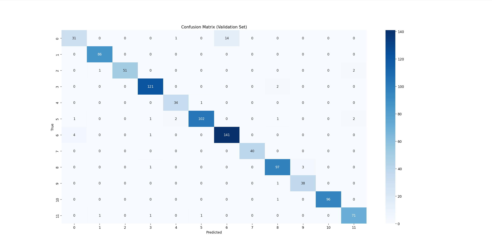
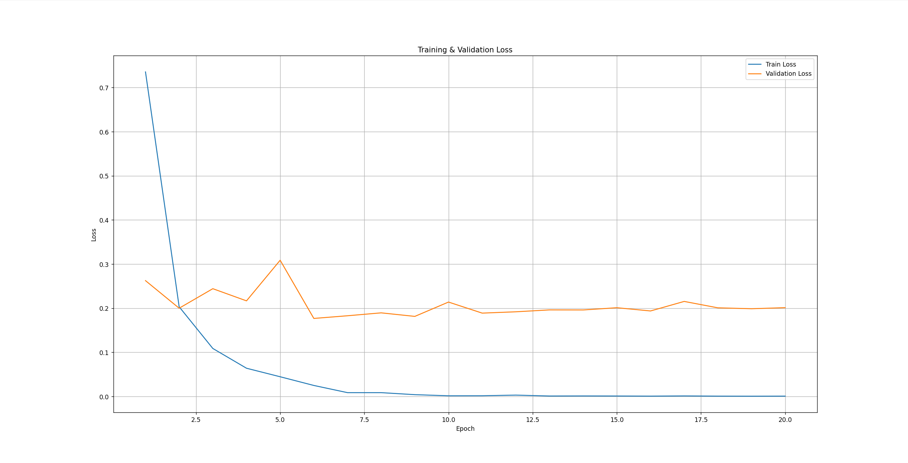

# Plant Recognition with ResNet50

Fine-tuning ResNet50 to adapt it for plant recognition tasks.

### Project Structure

```
Plant_Seedlings_Detect
│
├── data/ # Dataset folder (place the downloaded data here)
│ ├── plant-seedlings-classification
│ │ ├── train/
│ │ └── test/
├── images/ # loss_curve.png and confusion_matrix.png
├── ResNet50_train.py # Main script
├── requirements.txt
├── .gitignore
├── README.md
```

### Installation

```bash
pip install -r requirements.txt
```

### Results

The trained model will be saved in the root directory as `resnet50_plant.pth`.

---


